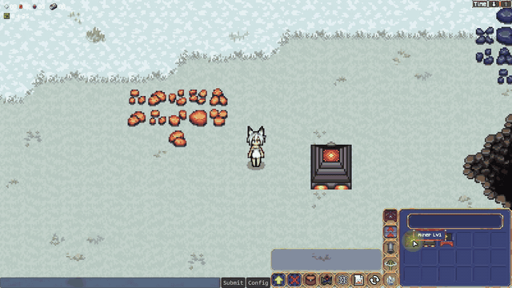
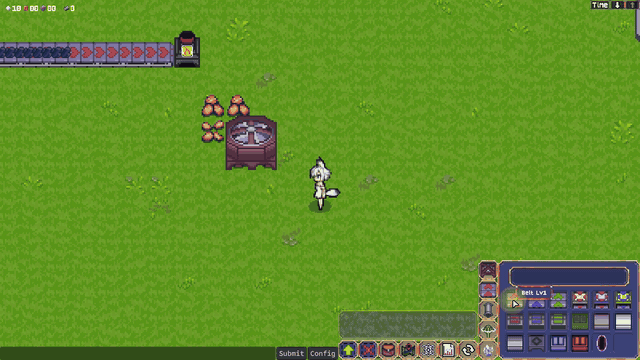

# BuildingPlacementSystem

건물 설치 전 미리보기부터 서버 검증, NetworkObject 생성, 건설 완료까지의 흐름을 정리한 코드 예시입니다.

이 샘플은 실제 프로젝트에서 사용한 `Building`, `PreBuilding`, `PreBuildingImg`, `BeltPreBuilding`, `Structure`의 핵심 코드를 발췌했습니다. 코드 구조와 배치 규칙은 유지하고, 포트폴리오에서 역할을 이해하기 쉽도록 파일과 클래스 이름만 변경했습니다.

## 이름 변경

| 실제 프로젝트 | 포트폴리오 샘플 | 역할 |
| --- | --- | --- |
| `Building` | `BuildingDefinition` | 건물 프리팹, 크기, 방향, 이미지 데이터 |
| `PreBuilding` | `BuildingPlacementController` | 미리보기, 배치 검사, 서버 설치 요청 |
| `PreBuildingImg` | `BuildingPlacementPreview` | 미리보기 이미지 및 유닛 충돌 검사 |
| `BeltPreBuilding` | `BeltPlacementController` | 드래그 기반 연속 벨트 배치 |
| `Structure.isPreBuilding` | `StructureConstruction.IsUnderConstruction` | 실제 건물의 건설 진행 상태 |

## 일반 건물 배치 흐름

```text
1. Client의 로컬 미리보기
   타일 중심 이동 / Client 측 검사 결과 색상 표시
        ↓
2. 설치 요청
   건물 인덱스 / 위치 / 방향 / 맵 정보를 ServerRpc로 전달
        ↓
3. 서버 측 재검증
   비용 / 포탈 중복 / Structure 점유 확인
        ↓
4. 생성과 비용
   NetworkObject 생성 후 방향·건물 정보와 맵 위치 데이터 적용 / 요청된 건물 비용 차감
        ↓
5. 건설 완료
   ClientRpc로 건설 상태를 완료로 변경 / UI 갱신
```



## 1. Client의 로컬 미리보기

마우스를 움직이는 동안에는 실제 네트워크 건물을 생성하지 않고 로컬 미리보기 오브젝트만 타일 중심으로 이동시킵니다.

미리보기는 맵 셀 상태와 플레이어·유닛 충돌을 검사하고, 설치 가능 여부에 따라 초록색 또는 빨간색으로 표시합니다.

```csharp
bool canBuild = preview.buildingPosUnit.Count == 0 &&
                CellCheck(previewObject, position);

preview.spriteRenderer.color =
    canBuild ? Color.green : Color.red;
```

## Client에서 확인하는 배치 규칙

`CellCheck()`에서 실제 프로젝트의 다음 조건을 검사합니다.

- `1×1`, `2×2` 건물의 점유 셀 계산
- 이미 설치된 건물과 맵 오브젝트 확인
- 오염 지역과 절벽 지형 확인
- 포탈 영역 중복 확인
- 벨트 위에 설치할 수 있는 건물 예외 처리
- `Miner`, `PumpCtrl`, `ExtractorCtrl`의 자원별 배치 조건
- 건물 레벨과 자원 레벨 비교

건물 종류와 셀 상태에 대한 문자열 및 컴포넌트 분기는 실제 작업 코드의 구현 방식을 그대로 유지했습니다.

## 2~4. 설치 요청과 서버 확정

Client에서 배치 가능한 것으로 표시되더라도 설치 요청 뒤에 인벤토리나 맵 상태가 달라질 수 있습니다. 서버는 비포탈 건물의 재료, 포탈 중복, 요청된 1×1·2×2 셀의 기존 `Structure` 점유를 다시 확인합니다.

지형, 유닛 충돌, 자원 종류와 레벨은 공개 샘플에서 Client 측 검사만 확인됩니다. 서버가 다시 검사한다고 설명하지 않습니다.

모든 위치가 검사를 통과하면 서버가 프리팹을 생성하고 `NetworkObject.Spawn()`을 호출한 뒤 건물 설정과 맵 데이터를 전달합니다. 요청된 건물 생성이 끝난 다음 `PayCost()`를 호출합니다.

```csharp
if (!costEnough)
    return;

if (cell.structure)
    return;

networkObject.Spawn(true);
PayCost(isHostMap, buildingData, spawnCount);
```

## 연속 벨트 배치

벨트는 드래그한 모든 위치를 한 번에 처리하지 않고, 설치할 수 없는 셀을 기준으로 연속된 설치 가능 구간을 나눕니다.

각 구간의 위치와 방향 정보를 배열로 만들어 서버 설치 요청에 사용합니다. 공개된 `BeltPlacementController`에서는 구간 분리와 배열 생성까지 확인되며, `PlaceBeltGroupServerRpc()`의 실제 서버 처리 본문은 생략되어 있습니다.



## 5. 건설 완료 상태

네트워크에 생성된 건물은 건설 중 상태로 시작합니다. 시간에 따라 건설 게이지와 체력이 증가하고, 서버가 게이지 완료를 확인하면 ClientRpc로 건설 상태를 완료로 변경하고 UI를 갱신합니다.

생산·물류 기능을 직접 활성화하는 코드는 공개 샘플에 포함되어 있지 않습니다.

## 핵심 구현

- 네트워크 통신 없이 동작하는 로컬 건물 미리보기
- 타일 상태와 동적 오브젝트 충돌을 함께 확인하는 배치 검사
- 설치 확정 시점의 서버 비용 및 셀 점유 재검사
- 서버에서 실제 NetworkObject 생성 및 비용 차감
- 드래그 경로를 연속된 설치 가능 구간으로 나누는 벨트 배치
- 건물 생성 이후 건설 상태와 완료 UI 처리

## 확인한 내용

점유 셀, 유닛 충돌, 포탈 중복, 자원 조건과 재료 부족 상황을 각각 확인했습니다. Client 측 검사를 통과한 요청도 서버 시점의 재료나 셀 상태가 달라지면 거절되고, 통과하면 NetworkObject 생성 후 비용이 차감되는 흐름을 테스트했습니다.

## 공개 범위

입력 시스템, UI 연결, 포탈·지하 건물의 전체 분기, 블루프린트 배치, 맵 저장 세부 구현은 이 샘플의 설명 범위에서 제외했습니다.
