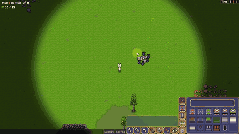
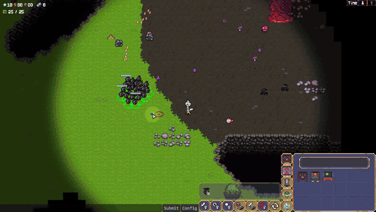

# Planet Gemini Code Samples

실제 출시한 2인 협동 공장 자동화 게임 **Planet Gemini**에서 구현했던 일부 시스템을 포트폴리오용으로 정리한 코드 샘플 저장소입니다.

실제 프로젝트 코드에서 제가 담당한 흐름을 골라 공개용 이름과 주석으로 정리했습니다. 프로젝트 의존 코드가 생략된 메서드는 각 README에 공개 범위를 표시했습니다.

일부 구현 방식은 Unity 공식 문서와 다양한 기술 자료를 참고했으며, 프로젝트 요구사항에 맞게 직접 수정 및 적용했습니다.

## 기능 영상

| Feature | Video |
| --- | --- |
| 유닛 선택, 이동 및 패트롤 |  |
| 스포너에서 생성된 몬스터와 주변 유닛의 전투 |  |
| 건물 배치 및 건설 진행 |  |
| 드래그 기반 연속 벨트 설치 |  |

## 포트폴리오에서 보는 순서

```text
유닛 입력과 명령 전달
    → 몬스터 상태 전환과 타깃 선정
    → Client의 로컬 미리보기와 서버 건물 생성
    → ServerTime 기반 벨트 이동
    → 중간 접속 오브젝트 상태 동기화
    → 주변 탐색의 프레임 분산
    → WorldObj 컴포넌트 캐시
    → JSON 연구 콘텐츠 데이터
```

각 샘플은 서로 다른 문제를 다룹니다. 네트워크 동기화, 프레임 작업량, 공통 코드 구조, 콘텐츠 데이터 관리를 하나의 성과로 묶지 않고 README별로 구현 범위와 확인한 내용을 구분했습니다.

## 주요 샘플

| Sample | Topic | Description |
| --- | --- | --- |
| [UnitCommandSystem](./UnitCommandSystem/README.md) | 유닛 명령 / 몬스터 AI | 입력, 선택 목록, 그룹 명령, ServerRpc, 서버 상태 전환과 몬스터 타깃 점수를 정리한 예시입니다. |
| [BuildingPlacementSystem](./BuildingPlacementSystem/README.md) | 건물 배치 / 건설 상태 | Client의 로컬 미리보기, 서버 측 재검증, NetworkObject 생성과 건설 완료 상태를 정리한 예시입니다. |
| [BeltItemSync](./BeltItemSync/README.md) | ServerTime 기반 위치 계산 | 좌표를 계속 전송하지 않고 진입 시간과 ServerTime으로 각 환경에서 아이템 위치를 계산한 예시입니다. |
| [NetworkObjManager](./NetworkObjManager/README.md) | 신규 Client 동기화 | 구조물·벨트 그룹·벨트의 생성 확인과 데이터 배치 전송을 이용한 중간 접속 흐름입니다. |
| [SearchBatchProcessing](./SearchBatchProcessing/README.md) | 주변 탐색 분산 | 서버에서 수행하는 유닛·타워·건물 탐색을 `searchCap` 기준으로 여러 프레임에 나눈 예시입니다. |
| [WorldObj](./WorldObj/README.md) | 컴포넌트 캐싱 | 생성 시 컴포넌트와 프로젝트에서 정의한 부모 클래스 타입까지 캐싱하고 `Has/Get/TryGet`으로 조회한 예시입니다. |
| [JsonBasedScienceDataManagement](./JsonBasedScienceDataManagement/README.md) | JSON 연구 콘텐츠 데이터 | 코어 레벨과 `sortIndex`를 기준으로 연구 데이터를 조회하고 UI 아이콘을 생성한 예시입니다. |

## 대표적으로 보여주고 싶은 부분

이 저장소에서는 아래와 같은 구현 경험을 중심으로 정리했습니다.

- 유닛 입력부터 서버 행동 상태 변경까지 이어지는 명령 전달 흐름
- 거리·어그로·대상별 공격 몬스터 수를 반영한 타깃 재선정
- 화면 반응을 위한 Client의 로컬 미리보기와 게임 상태를 바꾸는 서버 판정의 분리
- ServerTime을 공유하는 벨트 이동 계산과 중간 접속 동기화 순서
- `searchCap`을 이용한 주변 탐색 작업 분산
- 상속 타입을 포함한 컴포넌트 캐시와 JSON 연구 콘텐츠 데이터 처리

## 공개 범위

경로 생성 도구, 에셋 참조, 기획 데이터, UI 연결부처럼 제가 설명하려는 흐름과 직접 관련 없는 부분은 제외했습니다. 코드가 생략된 부분을 README 설명만으로 구현된 것처럼 보이지 않도록 공개 샘플에서 확인 가능한 범위를 함께 적었습니다.
